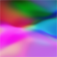
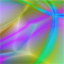
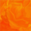
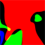
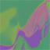
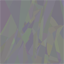
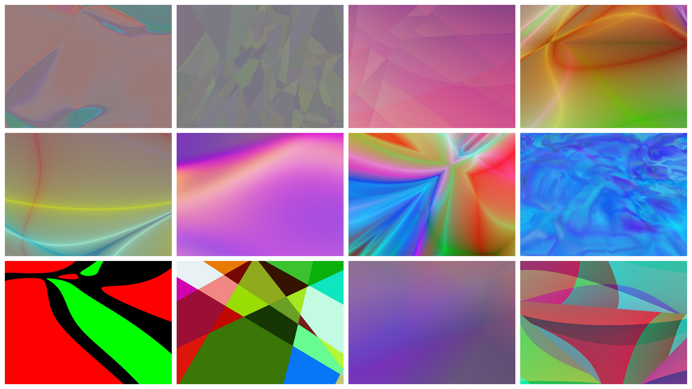

# Npainter 

Artistic patterns using recurrent neural network.
We use recurrent neural network that takes coordinate (x, y) and outputs RBG value to generate the patterns.
[recurrent.js] (https://github.com/karpathy/recurrentjs) used for RNN with the power of webworker and the result is cool artistic patterns.

You can try [Npainter](https://rupeshs.github.io/npainter/)

To test infinte style patterns change following parameters

1.Number of neurons per layer

2.Number of hidden layers

3 Stroke strength

Different non linearity functions used to generate patterns.

| Style         |Non linearity function | stroke strength
| ------------- |:-------------:|:-------------:|
|     | out.w[i] = Math.log10(Math.abs(m.w[i]) + sstrength); | 1e-1 to 1e-10|
|        | out.w[i] = Math.tanh(Math.abs(m.w[i])) | |
|      | out.w[i] = Math.log(Math.abs(m.w[i]) + 0.1) |  |
|     | out.w[i] = out.w[i] = Math.tanh(Math.abs(m.w[i])) |  |
|       |out.w[i] = Math.abs(m.w[i] * m.w[i])|  |
|       |  out.w[i] = m.w[i] * Math.abs(1 / m.w[i])|  |
|       |  out.w[i] = m.w[i] * Math.log10(Math.abs(m.w[i] * m.w[i]) + sstrength);| 1e-1 to 1e-10 |
|       |   out.w[i] = Math.abs(1 / m.w[i]) * m.w[i] * Math.log(Math.abs(m.w[i]) + 9e-1)|  |
|       |   out.w[i] = Math.log(Math.abs(m.w[i]) + 1)|  |
|       |   out.w[i] = Math.abs(1 / Math.tanh(m.w[i])) * m.w[i] * Math.log10(Math.abs(m.w[i]) + 8.5e-1)|  |
|       |    out.w[i] = Math.abs(1 / m.w[i]) * m.w[i] * Math.log10(Math.abs(m.w[i]) + 1e-1);|  |

# Gallery
High res available [here]( https://rupeshs.github.io/npainter/gallery.html)

